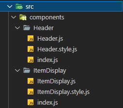

# Merhaba!

Bu repository, patika'nın takip etmekte olduğum React Native eğitiminde bulunan bir ödev. Kısaca kurgudan bahsedersek, patika kendi teknolojik ürünlerini satmak için bir market oluşturuyor. Bu marketin mobil uygulamasının küçücük bir kısmını yapma şansı elde ediyoruz! 

## Ödevin kendisine [burdan](https://app.patika.dev/courses/react-native/odev_1) ulaşabilirsiniz!

## Kodları Nasıl Yazdım?
Ödevi iyice okuduktan sonra, 
```bash
npx react-native init Patikastore
```
komutu ile projemi oluşturarak başladım. Bu proje herhangi bir external kütüphane kullanmadığından sadece React Native'in kendi componentlarını kullanarak yapabilirsiniz.

Ardından tasarıma göre yapacağım componentları oluşturdum.



Kodlama kısmında Stokta Yok kısmı için basit bir JavaScript fonksiyonu kullandım.


```bash
const renderStock = (products) => {
    if (products === false) {
        return <Text style={styles.stock}>STOKTA YOK</Text>
    }
}
```

## Sonuç Olarak
Kendimi sınadığım ve neleri çok iyi anlamadığımı gördüğüm bir proje oldu. Umarım bir yanlış yapmamışımdır :)